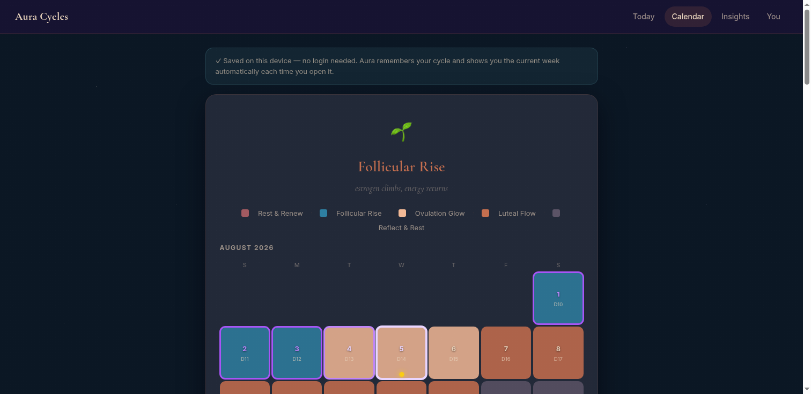

# Aura Cycles — sync your cycle, maximize your aura

**Live app → https://www.auracycles.app**



Aura Cycles is a **women's health tracking app** that tracks her cycle and, based on
**which week she is in**, recommends whether to take a **pilates class or strength
training**, whether to go to the **speed-dating event during her follicular or ovulation
week**, and whether to schedule that **super-important work meeting before or after her
period**. It also factors in **special diets** (e.g. gluten-free but craving carbs) and
**which week those cravings hit**. Built for women in **perimenopause and menopause**.

**Roadmap:** a peptide-recommendations section, GLP-1 start-timing ("during the luteal
stretch, or after?"), and an **LLM coach** that turns all the data + logged symptoms into
a dynamic recommendation engine you can ask anytime. Full direction: `docs/product-vision.md`.

A woman enters her last 2–3 period start dates and a few lifestyle details (age, workout,
diet, social life, relationship); the app computes her cycle day and current stretch of the
cycle, then returns a color-coded calendar plus recommendations for training, diet, social
life, and focus — matched to each stretch. She can also log daily energy, symptoms, and a
note — all persisted in her browser (localStorage), never sent to a server.

**The Aura Engine is 100% deterministic** — pure Python, no LLM, no external calls.
Nothing can hallucinate your cycle. A self-hosted LLM "coach" layer can be
dropped on later without touching the engine.

## Run it

### Locally (no Docker)
```bash
python3 -m venv .venv && source .venv/bin/activate
pip install -r requirements.txt
uvicorn main:app --host 0.0.0.0 --port 8000
# open http://localhost:8000
```

### Docker (recommended)
```bash
docker compose up -d --build
# open http://<server-ip>:8000
```

That's the whole deploy. It binds port 8000.

## Put it on your own server
1. Provision a box (any VPS — a $5–10/mo 1–2 vCPU is plenty for the
   deterministic app; only the optional LLM coach needs a GPU).
2. Copy this folder up and run `docker compose up -d --build`.
3. Point a domain at it (e.g. Caddy/nginx in front of port 8000, or a load
   balancer) if you want a real URL with HTTPS.

## Tests
```bash
pip install pytest
python -m pytest tests/ -v
```

## Architecture
- `engine.py` — **The Aura Engine**, the trust layer. Cycle math, stretch-of-the-cycle
  classification, calendar projection, and recommendation copy. Pure functions, fully unit-tested.
- `main.py` — thin FastAPI shell: serves the UI + `POST /api/read`.
- `static/` — single-page UI (vanilla HTML/CSS/JS, no framework).

## LLM coach layer (optional, v2 — decided, not yet built)
**BYOK (bring your own key).** Users paste their own provider key (OpenAI,
Anthropic, OpenRouter, or a local Ollama URL). We self-host no LLM and pay no
tokens — the key passes through a thin `/api/coach` proxy per-request and is
never stored. Full design: `docs/llm-coach.md`.

The deterministic engine is the whole app on its own; the coach is an optional
unlock. The engine/coach split means this drops in without touching `engine.py`.

## Privacy
The deterministic app stores nothing and calls no third party. The UI keeps
inputs in the browser until you hit the button, and the server keeps nothing.
This is a health-adjacent product — privacy is the feature, not an afterthought.

> General wellness guidance, not medical advice. Perimenopause and menopause
> especially deserve a clinician's input.

## License
MIT — see [LICENSE](LICENSE).
